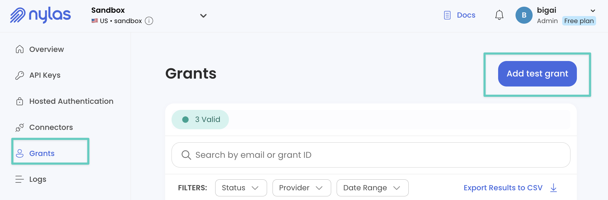

# Inbox MCP - AI Email Assistant for Juli

Transform your inbox into an intelligent, AI-powered assistant that understands natural language and handles complex email workflows seamlessly.

Inbox MCP is an HTTP-based [Model Context Protocol (MCP)](https://modelcontextprotocol.io) server designed specifically for [Juli](https://juli-ai.com), providing intelligent email management through conversational AI. Built on [Nylas v3](https://nylas.com), it works with Gmail, Outlook, iCloud, Yahoo, and any IMAP service.

> **🚀 For MCP Developers**: This repository serves as a comprehensive example of how to build production-ready MCP servers for the Juli platform. Use it as a reference to create your own amazing tools that thousands of Juli users will love!

## 🏗️ Architecture

- **HTTP-Only Server**: Stateless REST API with multi-user support
- **AI-First Design**: Natural language understanding powered by OpenAI
- **Context Injection**: Automatic user data population via Juli
- **Stateless Approvals**: Safe execution with preview and confirmation
- **Zero Configuration**: Credentials managed entirely by Juli

## 🎯 Key Features

- **Natural Language**: Say "reply to Sarah about the meeting" - it just works
- **Smart Signatures**: User name and email automatically injected by Juli
- **Batch Operations**: Process hundreds of emails with a single command
- **AI Analysis**: Get insights, summaries, and action items automatically
- **Universal Compatibility**: Works with any email provider through Nylas

---

## ✨ Real-life examples (things you'll actually say)


| You casually say…                                                                         | Inbox MCP effortlessly handles it by…                                                                 |
| ----------------------------------------------------------------------------------------- | ----------------------------------------------------------------------------------------------------- |
| *“take a look at my inbox and LMK what's important and what i have to act on”*            | Reviewing your messages, quickly identifying actionable emails, and summarizing what needs attention. |
| *“Find the unimportant emails from my last 100 and move them to the Unimportant folder.”* | Intelligently filtering out low-priority emails and neatly organizing them out of sight.              |
| *“Archive everything older than two weeks, except starred emails.”*                       | Batch-archiving older emails while safely preserving your starred messages.                           |
| *“Summarize and forward the latest AWS alerts to my team.”*                               | Compiling recent AWS alerts into a concise summary and sending it off immediately.                    |


---

## 🧪 Testing

The project includes comprehensive end-to-end tests that validate real functionality with OpenAI and Nylas APIs.

```bash
# Run unit tests
npm test

# Run E2E tests (requires .env.test configuration)
npm run test:e2e

# Run interactive E2E tests with user prompts
npm run test:e2e:interactive
```

See [tests/e2e/README.md](tests/e2e/README.md) for detailed testing documentation.

---

## 🎯 Why use Inbox MCP?

- **Inbox Zero, Simplified:** Quickly automate email management using natural language instructions.
- **Efficient Triage:** Instantly categorize, prioritize, and batch-process emails effortlessly.
- **Easy Setup:** Seamless integration with Juli - credentials managed securely by the platform.
- **HTTP Architecture:** Modern HTTP-based MCP server with multi-user support.

---

## 📌 Quick Setup: Creating a Nylas Account

1. Sign up at: [Nylas Dashboard](https://dashboard-v3.nylas.com/register?utm_source=docs&utm_medium=devrel-surfaces&utm_campaign=&utm_content=quickstart).
2. Grab your API key from the sidebar (`API KEY`).  
   
3. Navigate to `Grants`, click `Add Test Grant` (top-right), and connect your email account.  
   
4. Note your API key and Grant ID (shown in the grants table).

---

## 🚀 Get started

### For Juli Users

Inbox MCP brings intelligent email management to your Juli experience. Once installed from Juli's MCP marketplace, you'll be guided through a simple setup process to connect your email account. Your credentials are stored securely by Juli - you only need to set them up once.

### For MCP Developers

1. **Clone and install:**
```bash
git clone https://github.com/yourusername/inbox-mcp.git
cd inbox-mcp
npm install
```

2. **Set up environment:**
```bash
cp .env.example .env
# Edit .env and add your OpenAI API key
```

3. **Build and start the server:**
```bash
npm run build
npm start
```

The HTTP server will start on port 3000 (or the port specified in your .env file).

### API Endpoints

- `GET /health` - Health check
- `GET /mcp/tools` - List available tools
- `POST /mcp/tools/:toolName` - Execute a tool
- `GET /mcp/needs-setup` - Check if setup is required

### Authentication

Nylas credentials are passed via HTTP headers on each request:
- `X-User-Credential-NYLAS_ACCESS_TOKEN`
- `X-User-Credential-NYLAS_GRANT_ID`

Juli handles this automatically. For direct API usage, include these headers in your requests.

---

## 🔧 Available Tools

### `manage_email`
**Natural language email composition and management**
- Send new emails, reply to threads, or forward messages
- AI understands context: "reply to Sarah thanking her for the proposal"
- Automatic recipient resolution and thread detection
- Smart signatures with Juli's context injection

### `find_emails`
**Intelligent email search with AI analysis**
- Natural language queries: "important emails from last week"
- AI-powered importance scoring and categorization
- Action item extraction and priority detection
- Flexible output formats (summary, detailed, action items)

### `organize_inbox`
**Bulk email operations with AI intelligence**
- Process hundreds of emails: "archive old newsletters keeping only important ones"
- Smart pattern recognition (receipts, notifications, newsletters)
- Dry-run mode for safety - preview before executing
- Intelligent filtering preserves important emails

### `email_insights`
**AI-powered analytics and summaries**
- Daily digests with priority items
- Communication pattern analysis
- Response time tracking
- Workload and relationship insights

### `smart_folders`
**Dynamic folder management with AI rules**
- Create intelligent folders: "urgent client emails"
- Auto-organization based on content understanding
- Learns from user corrections
- Works across all email providers

## ✨ Key Features

- **Natural Language Processing**: Just say what you want - the AI understands context and intent
- **Smart Context Injection**: User name and email automatically included in signatures (via Juli)
- **Stateless Approval Flow**: Review and approve actions before execution
- **Multi-User Support**: HTTP architecture supports multiple concurrent users
- **Provider Agnostic**: Works with Gmail, Outlook, iCloud, Yahoo, and any IMAP service

---

## 🚢 Deployment

### Docker (Recommended)
```bash
# Quick start with Docker Compose
docker-compose up -d

# Or build manually
docker build -t inbox-mcp .
docker run -p 3000:3000 --env-file .env inbox-mcp
```

See [DOCKER_GUIDE.md](DOCKER_GUIDE.md) for production deployment strategies.

### Manual Deployment
```bash
npm install
npm run build
npm start
```

### Environment Variables
- `OPENAI_API_KEY` - Your OpenAI API key (required)
- `PORT` - Server port (default: 3000)
- `NODE_ENV` - Environment (development/production)

---

## 🏛️ Architecture

### HTTP Server Design
```
Juli Client → HTTP Request → Inbox MCP Server
    ↓              ↓               ↓
User Data    Credentials    Tool Execution
    ↓              ↓               ↓
Context      Nylas Grant      AI Processing
Injection     Per Request      + Email API
```

### Stateless Operation
- No session state or user data storage
- Credentials passed per-request via headers
- Horizontal scaling ready
- Multi-user by design

### Security
- Credentials never stored locally
- All auth handled by Juli platform
- Non-root Docker containers
- Request-scoped Nylas clients

---

## 📚 Documentation

- [MCP Developer Guide](MCP_DEVELOPER_GUIDE.md) - Build MCP servers for Juli
- [Approval System Guide](APPROVAL_SYSTEM_GUIDE.md) - How approvals work
- [Tools Documentation](TOOLS_DOCUMENTATION.md) - Detailed tool reference
- [Docker Guide](DOCKER_GUIDE.md) - Production deployment

---

## 🗺️ Roadmap

- Enhanced provider-native search (advanced queries, multi-term searches)
- Calendar and contacts integration
- Expanded toolset and automation capabilities
- Webhook support for real-time email events

---

## 👩‍💻 Contributing

We welcome contributions! See [CONTRIBUTING.md](CONTRIBUTING.md) for guidelines.

### Development Setup
```bash
# Install dependencies
npm install

# Run tests
npm test

# Run in development mode
npm run dev
```

---

## 📄 License & Support

Licensed under [MIT](LICENSE).

Built with ❤️ for the Juli community. If Inbox MCP makes your day easier, please ⭐️ to help others discover it!