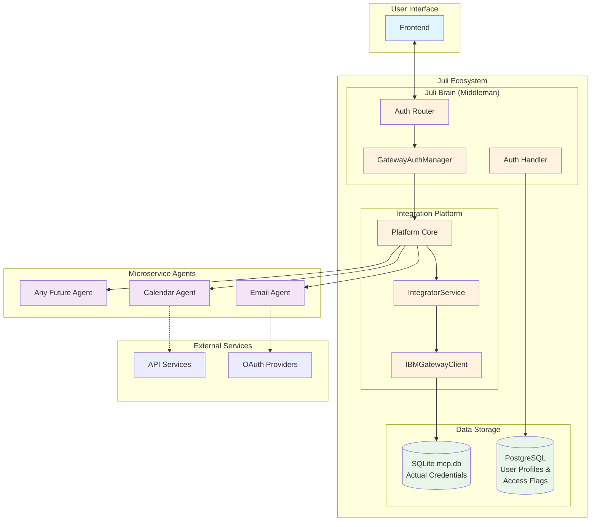
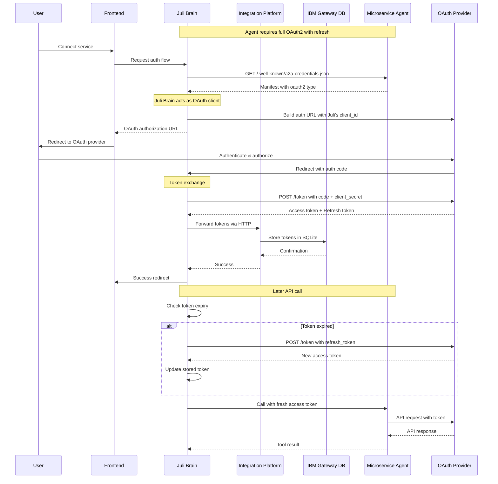
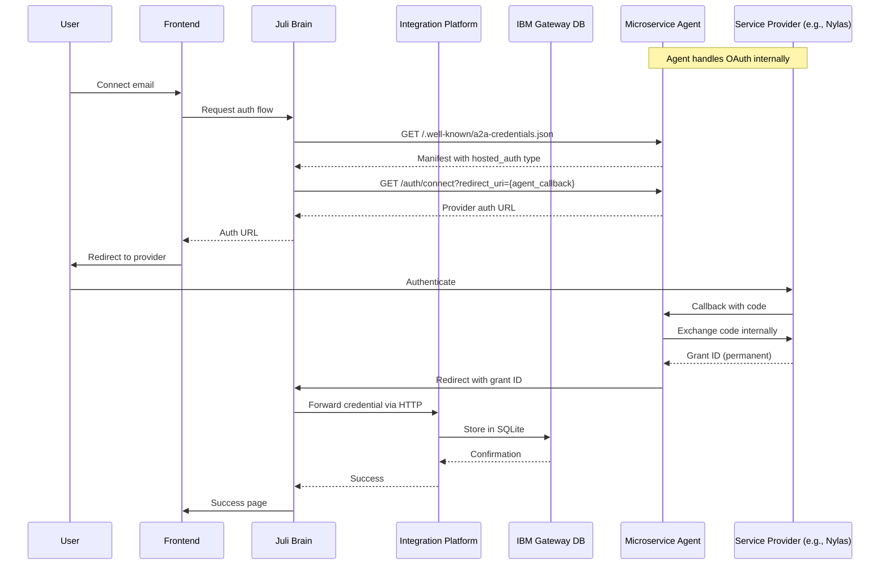
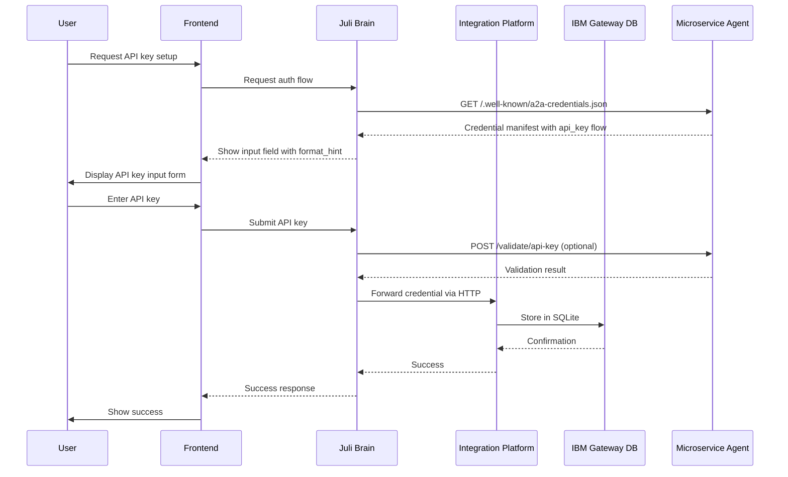
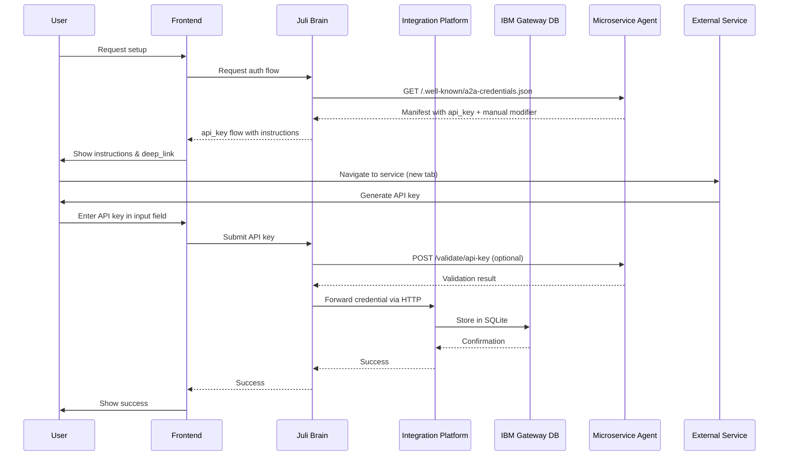
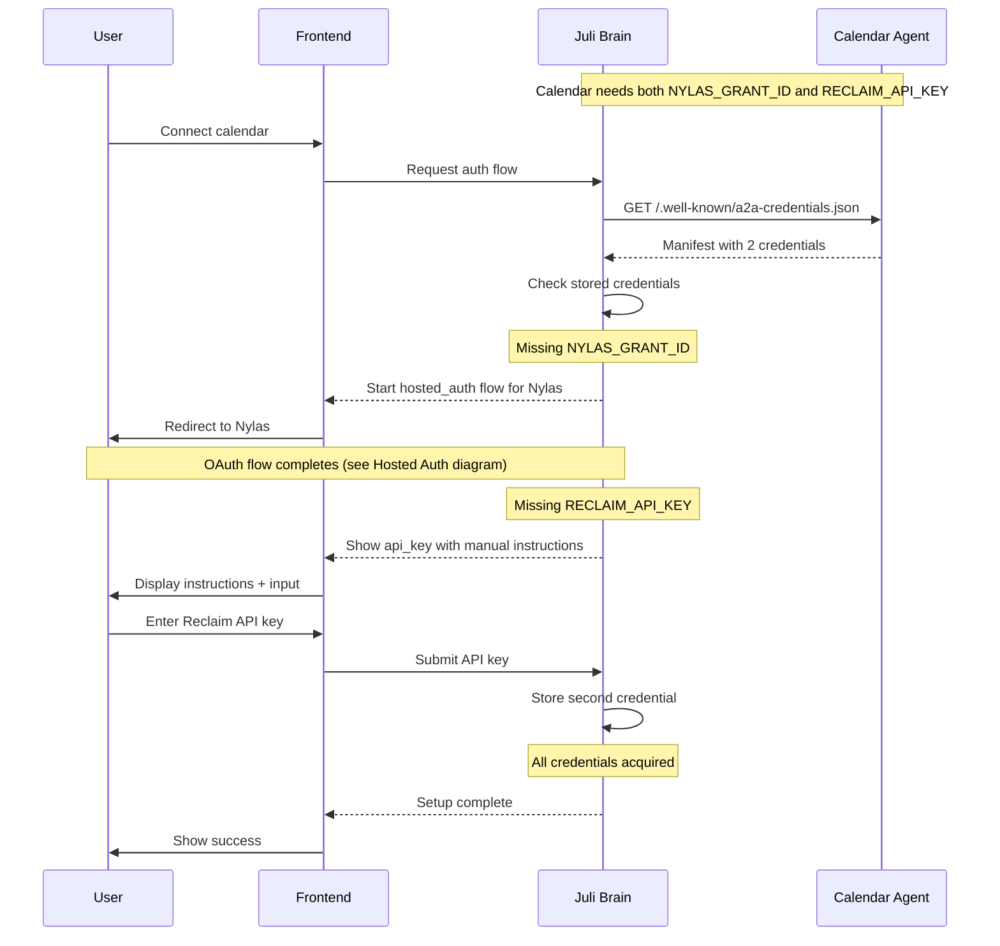
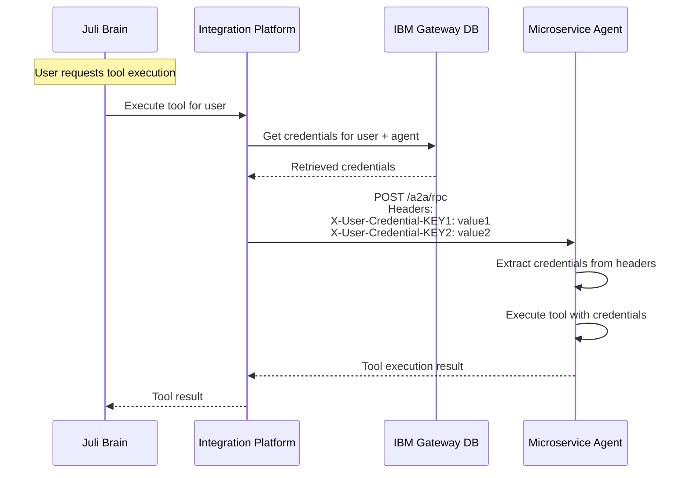
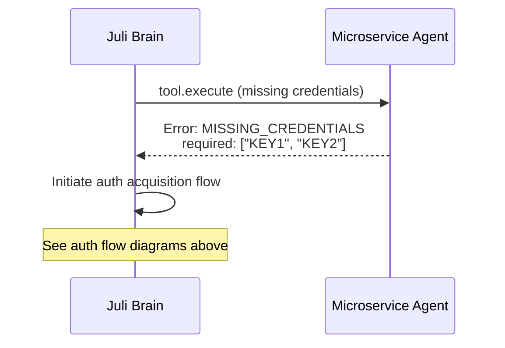

# A2A Authentication Acquisition Specification

## Executive Summary

This specification defines a universal authentication acquisition system for the A2A (Agent-to-Agent) protocol. The system enables any third-party microservice agent to declare its authentication requirements through a standardized manifest, while Juli Brain orchestrates all credential acquisition flows through a single, unified handler.

## Core Principles

1. **Stateless Microservices**: Agents never store user credentials or manage authentication state
2. **Centralized Storage**: Integration Platform (via IBM Gateway) stores all credentials securely
3. **Juli Brain as Router**: Juli Brain orchestrates auth flows but forwards credentials to Integration Platform
4. **Declarative Manifests**: Agents declare their needs; Juli Brain handles the complexity
5. **Universal Handler**: One system in Juli Brain handles all authentication types
6. **Frontend Isolation**: Frontend never communicates directly with microservice agents

## System Architecture



**Important Architecture Notes:**
- **Juli Brain**: Acts as a middleman/router for authentication flows. Does NOT store credentials directly.
- **Integration Platform**: Handles actual credential storage operations via IntegratorService and IBMGatewayClient.
- **Two Separate Databases**:
  - **SQLite (mcp.db)**: IBM Gateway's database storing actual sensitive credentials (API keys, OAuth tokens, grant IDs)
  - **PostgreSQL (auth_handler)**: Juli Brain's Auth Handler database storing user profiles and integration access flags
- **Credential Flow**: Agent → Juli Brain (redirect) → Integration Platform → IBM Gateway SQLite Database
- **Agents**: Completely stateless, receive credentials via header injection from Integration Platform.

## A2A Credential Manifest Standard

### Manifest Structure

Every microservice agent MUST expose a credential manifest at `/.well-known/a2a-credentials.json`:

```json
{
  "version": "1.0",
  "credentials": [
    {
      "key": "CREDENTIAL_KEY",
      "display_name": "Human-readable name",
      "description": "What this credential provides access to",
      "sensitive": true,
      "required": true,
      "flows": [
        {
          "type": "flow_type",
          // Flow-specific fields
        }
      ]
    }
  ]
}
```

### Supported Flow Types

#### 1. Full OAuth2 (`oauth2`)
For services requiring complete OAuth2 implementation with refresh tokens.

```json
{
  "type": "oauth2",
  "authorization_url": "https://provider.com/oauth/authorize",
  "token_url": "https://provider.com/oauth/token",
  "refresh_url": "https://provider.com/oauth/refresh",
  "client_id": "juli_platform_client_id",
  "scopes": ["read", "write", "offline_access"],
  "token_expiry_seconds": 3600,
  "supports_refresh": true,
  
  // Optional: Add manual instructions for OAuth setup
  "manual": {
    "instructions": "Before authorizing, ensure you have admin access...",
    "deep_link": "https://provider.com/app-settings"
  }
}
```

#### 2. Hosted Auth (`hosted_auth`)
For services that abstract OAuth complexity (like Nylas).

```json
{
  "type": "hosted_auth",
  "connect_url": "/auth/connect",
  "callback_url": "/auth/callback",
  "provider": "nylas|custom"
}
```

#### 3. API Key (`api_key`)
For simple token/key authentication.

```json
{
  "type": "api_key",
  "format_hint": "sk-xxxxxxxx",
  "validation_endpoint": "/validate/api-key",
  
  // Optional: Add manual instructions if user must obtain key manually
  "manual": {
    "instructions": "1. Log into your account\n2. Navigate to Settings > API\n3. Generate new key\n4. Copy and paste below",
    "deep_link": "https://service.com/settings/api"
  }
}
```

#### 4. Basic Auth (`basic_auth`)
For username/password authentication.

```json
{
  "type": "basic_auth",
  "fields": {
    "username": {
      "type": "string",
      "label": "Username"
    },
    "password": {
      "type": "password",
      "label": "Password"
    }
  },
  
  // Optional: Add manual instructions
  "manual": {
    "instructions": "Use your service account credentials...",
    "deep_link": "https://service.com/account"
  }
}
```

#### Manual Instructions Modifier
Any authentication type can include a `manual` object to provide user guidance:

```json
"manual": {
  "instructions": "Step-by-step instructions for obtaining credential",
  "deep_link": "URL to service's settings page",
  "requirements": "Any prerequisites or requirements"
}
```

When `manual` is present, the frontend should:
1. Display the instructions to the user
2. Provide a button/link to open the deep_link in a new tab
3. Show an input field for the credential
4. Submit to Juli Brain for validation and storage

## When to Use Each Authentication Type

### Decision Matrix

| Scenario | Use This Type | Add Manual? | Why |
|----------|--------------|-------------|-----|
| Service provides full OAuth2 endpoints | `oauth2` | Optional | Juli Brain manages tokens and refresh |
| Service handles OAuth internally (Nylas) | `hosted_auth` | No | Agent abstracts complexity |
| Service uses API keys (direct input) | `api_key` | No | User already has key |
| Service requires generating API key | `api_key` | **Yes** | Guide user to obtain key |
| Service requires username/password | `basic_auth` | Optional | Direct credential input |

### Key Principles
1. **Use the simplest type that matches the credential**:
   - API key → `api_key` (regardless of how it's obtained)
   - Username/password → `basic_auth`
   - OAuth tokens → `oauth2` or `hosted_auth`

2. **Add `manual` modifier when user needs guidance**:
   - User must navigate to external site to generate key
   - Complex setup steps required
   - Prerequisites or special instructions needed

3. **Let Juli Brain handle all storage and injection**

## Authentication Types & Industry Standards

### Industry Context
Following industry leaders (Zapier, Make.com, n8n), our system uses **centralized OAuth management** where:
- Juli Brain acts as the OAuth client for all integrations
- Tokens are stored and managed centrally
- Automatic refresh handling for OAuth2 tokens
- Per-user credential isolation

### Authentication Type Handling

#### Type 1: Full OAuth2 (`oauth2`)
For services requiring complete OAuth2 implementation with refresh tokens:
```json
{
  "type": "oauth2",
  "auth_url": "/oauth/authorize",
  "token_url": "/oauth/token",
  "refresh_url": "/oauth/refresh",
  "scopes": ["read", "write"],
  "token_expiry": 3600
}
```
**Juli Brain handles**:
- Token exchange (code for access/refresh tokens)
- Automatic token refresh before expiry
- Secure storage of both tokens
- Injection of fresh access token on each request

#### Type 2: Hosted Auth (`hosted_auth`)
For services (like Nylas) that abstract OAuth complexity:
```json
{
  "type": "hosted_auth",
  "connect_url": "/auth/connect",
  "provider": "nylas"
}
```
**Microservice handles**:
- OAuth complexity internally
- Returns simple grant ID
- Manages token refresh internally

#### Type 3: Simple Credentials (`api_key`, `basic_auth`)
For non-OAuth authentication:
```json
{
  "type": "api_key",
  "format_hint": "sk-xxxxxxxx"
}
```
**Direct storage**: No token management needed

## Authentication Flows

### Full OAuth2 Flow (with Refresh Tokens)



### Hosted Auth Flow (Simplified)



**Key Points:**
- Agent handles OAuth exchange and redirects to Juli Brain
- Juli Brain acts as middleman, forwards to Integration Platform
- Integration Platform stores credentials in IBM Gateway SQLite database
- Agents remain completely stateless

### API Key Flow



### API Key with Manual Instructions Flow



### Multi-Credential Flow



## Credential Injection

Once credentials are acquired, the Integration Platform injects them when calling microservice agents:



## Error Handling

### Missing Credentials

When a microservice agent receives a request without required credentials:



## Security Considerations

1. **No Credentials in URLs**: Credentials never appear in query parameters or URLs (except during OAuth redirect from agent to Juli Brain)
2. **HTTPS Only**: All communication must use TLS 1.3+
3. **Secure Storage**: Integration Platform stores credentials in IBM Gateway SQLite database, encrypted at rest
4. **Header Injection**: Credentials only transmitted via secure headers
5. **Validation**: Optional validation endpoints for credential verification
6. **State Parameter**: OAuth flows must use state parameter for CSRF protection
7. **Separation of Concerns**: Juli Brain never stores credentials directly, only forwards them

## Extensibility

The system supports future authentication methods by:

1. **Adding New Flow Types**: New `type` values in the manifest
2. **Custom Fields**: Flow-specific fields for unique requirements
3. **Validation Endpoints**: Optional validation for any flow type
4. **Provider Extensions**: Provider-specific data in flow definitions

## Implementation Requirements

### Microservice Agents Must:
1. Expose `/.well-known/a2a-credentials.json` endpoint
2. Provide connect URLs for hosted auth flows
3. Accept redirect_uri parameter for OAuth flows
4. Never store user credentials
5. Return structured errors for missing credentials

### Juli Brain Must:
1. Discover and parse credential manifests
2. Orchestrate all authentication flows
3. Forward credentials to Integration Platform for storage
4. Request credential injection from Integration Platform
5. Handle OAuth callbacks and redirect to Integration Platform
6. Track credential acquisition state per user (via Auth Handler PostgreSQL)

### Frontend Must:
1. Communicate only with Juli Brain
2. Display instructions and input fields as directed
3. Handle redirects for OAuth flows
4. Never directly call microservice agents
5. Show clear success/error states

## Example Implementations

### Simple API Key Service

```json
{
  "version": "1.0",
  "credentials": [
    {
      "key": "SERVICE_API_KEY",
      "display_name": "Service API Key",
      "description": "API key for accessing service features",
      "sensitive": true,
      "required": true,
      "flows": [
        {
          "type": "api_key",
          "format_hint": "svc_xxxxxxxxxxxxxxxx"
        }
      ]
    }
  ]
}
```

### OAuth-Only Service

```json
{
  "version": "1.0",
  "credentials": [
    {
      "key": "OAUTH_GRANT",
      "display_name": "Account Access",
      "description": "OAuth grant for full account access",
      "sensitive": true,
      "required": true,
      "flows": [
        {
          "type": "hosted_auth",
          "connect_url": "/oauth/connect",
          "provider": "custom"
        }
      ]
    }
  ]
}
```

### Complex Multi-Auth Service (Correct Pattern)

```json
{
  "version": "1.0",
  "credentials": [
    {
      "key": "MAIN_OAUTH_GRANT",
      "display_name": "Primary Account",
      "description": "Main account connection",
      "sensitive": true,
      "required": true,
      "flows": [
        {
          "type": "hosted_auth",
          "connect_url": "/auth/primary",
          "provider": "google",
          "provider_scopes": {
            "google": ["email", "profile", "calendar"]
          }
        }
      ]
    },
    {
      "key": "INTEGRATION_API_KEY",
      "display_name": "Integration API Key",
      "description": "Additional integration key",
      "sensitive": true,
      "required": true,
      "flows": [
        {
          "type": "api_key",
          "format_hint": "int_xxxxxxxxxx",
          "validation_endpoint": "/validate/api-key",
          "manual": {
            "instructions": "1. Log into your account\n2. Navigate to Settings > API\n3. Generate a new key\n4. Copy and paste below",
            "deep_link": "https://app.service.com/settings/api"
          }
        }
      ]
    }
  ]
}
```

## Conclusion

This specification provides a complete, extensible system for authentication acquisition in the A2A protocol. By centralizing orchestration in Juli Brain while keeping microservices stateless, the system achieves:

- **Simplicity**: Microservices only declare needs, not implement flows
- **Security**: Centralized credential management with proper isolation
- **Flexibility**: Support for any authentication pattern
- **Scalability**: Easy addition of new services and auth types
- **User Experience**: Consistent, guided authentication flows