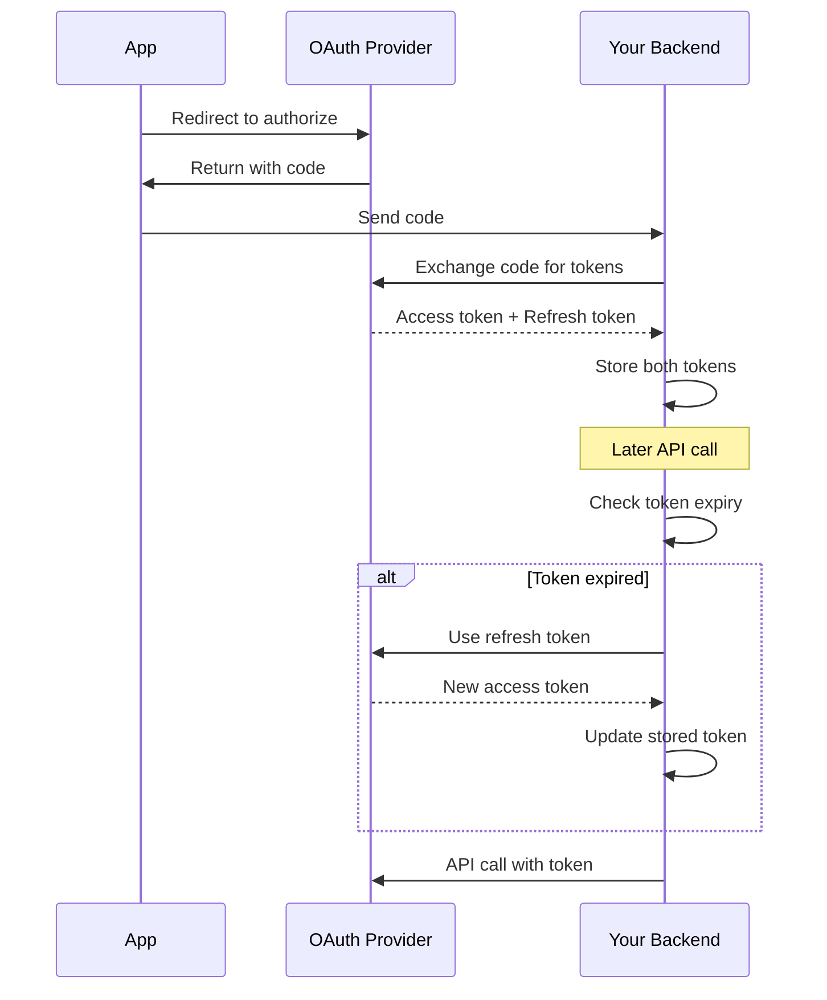
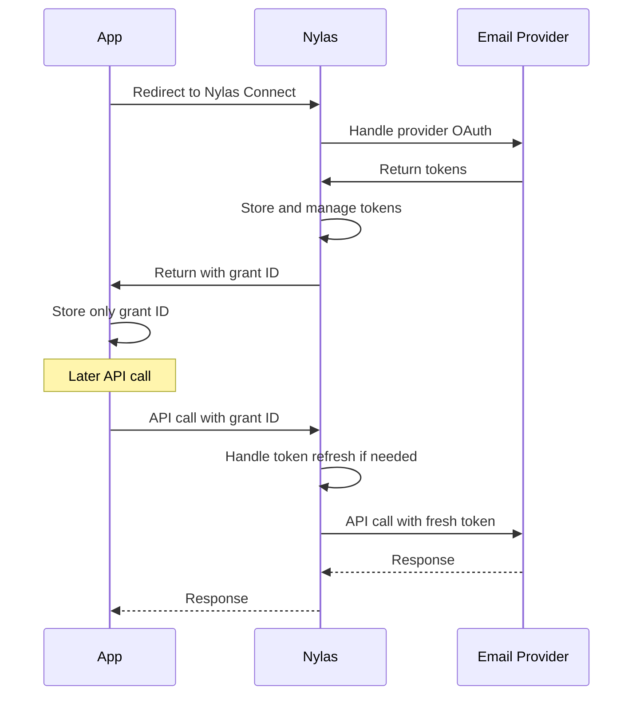

# Nylas Grant ID Architecture

## Overview

This document explains the Nylas Grant ID architecture and how it simplifies email integration compared to traditional OAuth implementations.

## What is a Nylas Grant ID?

A Nylas Grant ID is a permanent, unique identifier that represents a user's authenticated email account. It abstracts away the complexity of OAuth tokens, refresh tokens, and provider-specific authentication flows.

### Key Characteristics

1. **Permanent**: Once created, a grant ID doesn't expire
2. **Provider-agnostic**: Works the same for Gmail, Outlook, iCloud, etc.
3. **Token management**: Nylas handles all token refresh internally
4. **Simplified API**: Use one grant ID instead of managing multiple tokens

## Traditional OAuth vs Nylas Hosted Auth

### Traditional OAuth Flow



**Complexity:**
- Manage access tokens and refresh tokens
- Handle token expiration and refresh logic
- Different flows for each provider (Google, Microsoft, etc.)
- Store sensitive tokens securely
- Implement retry logic for expired tokens

### Nylas Hosted Auth Flow



**Simplicity:**
- Store only the grant ID
- No token management
- Same flow for all providers
- Nylas handles all OAuth complexity
- Automatic token refresh

## Grant ID Lifecycle

### 1. Creation

Grant IDs are created when a user completes the Nylas Connect flow:

```typescript
// User completes OAuth through Nylas
const response = await nylas.auth.exchangeCodeForToken({
  clientId: NYLAS_CLIENT_ID,
  code: authorizationCode,
  redirectUri: CALLBACK_URI
});

const grantId = response.grantId;  // e.g., "grant_abc123xyz"
```

### 2. Storage

In the Juli ecosystem:
- **Agent**: Never stores the grant ID (stateless)
- **Juli Brain**: Routes the grant ID to Integration Platform
- **Integration Platform**: Stores in IBM Gateway SQLite database
- **Format**: `user-auth-{userId}` → `{agent_id}` → `{CREDENTIAL_KEY}` → `{grant_id}`

### 3. Usage

Every API call uses the grant ID:

```typescript
// List emails
const messages = await nylas.messages.list({
  identifier: grantId,  // Just pass the grant ID
  queryParams: { limit: 10 }
});

// Send email
await nylas.messages.send({
  identifier: grantId,  // Same grant ID
  requestBody: {
    to: [{ email: 'recipient@example.com' }],
    subject: 'Hello',
    body: 'Email content'
  }
});
```

### 4. Revocation

Grant IDs can be revoked:
- By the user through Nylas dashboard
- Programmatically via Nylas API
- When the user revokes app permissions at the provider

## Architecture Benefits

### 1. Security

**Traditional OAuth:**
- Store sensitive access tokens
- Risk of token leakage
- Complex token rotation

**Nylas Grant ID:**
- Grant ID is not a bearer token
- Requires API key + grant ID
- Centralized security management

### 2. Scalability

**Traditional OAuth:**
- Token refresh logic in every service
- Database overhead for token storage
- Complex distributed token management

**Nylas Grant ID:**
- Simple string storage
- No refresh logic needed
- Minimal database requirements

### 3. Multi-Provider Support

**Traditional OAuth:**
```typescript
// Different logic for each provider
switch(provider) {
  case 'google':
    // Google-specific OAuth flow
    break;
  case 'microsoft':
    // Microsoft-specific OAuth flow
    break;
  case 'icloud':
    // Apple-specific OAuth flow
    break;
}
```

**Nylas Grant ID:**
```typescript
// Same for all providers
const messages = await nylas.messages.list({
  identifier: grantId  // Works for any provider
});
```

## Implementation in Juli Ecosystem

### 1. Agent Declaration

Agents declare they need a grant ID via manifest:

```json
{
  "credentials": [
    {
      "key": "EMAIL_ACCOUNT_GRANT",
      "type": "hosted_auth",
      "provider": "nylas"
    }
  ]
}
```

### 2. Credential Flow

```
User → Nylas Connect → Grant ID → Agent → Juli Brain → Integration Platform → Storage
                                     ↓
                                Never stores
```

### 3. Runtime Injection

```typescript
// Integration Platform injects grant ID
headers: {
  'X-User-Credential-EMAIL_ACCOUNT_GRANT': 'grant_abc123xyz'
}

// Agent extracts and uses
const grantId = credentials.EMAIL_ACCOUNT_GRANT;
await nylas.messages.list({ identifier: grantId });
```

## Common Patterns

### 1. Checking Grant Validity

```typescript
try {
  const account = await nylas.accounts.get({
    identifier: grantId
  });
  // Grant is valid
} catch (error) {
  if (error.statusCode === 401) {
    // Grant is invalid or revoked
  }
}
```

### 2. Multi-Account Support

```typescript
// User can have multiple grants
const personalGrant = credentials.PERSONAL_EMAIL_GRANT;
const workGrant = credentials.WORK_EMAIL_GRANT;

// Use different grants for different operations
await nylas.messages.send({
  identifier: workGrant,  // Send from work account
  requestBody: { ... }
});
```

### 3. Error Handling

```typescript
try {
  await nylas.messages.list({ identifier: grantId });
} catch (error) {
  if (error.statusCode === 401) {
    // Grant invalid - need re-authentication
    return { needs_auth: true, auth_url: '/auth/connect' };
  }
  // Other error handling
}
```

## Best Practices

### 1. Never Store Grant IDs in Agents
Agents should always receive grant IDs via injection, never store them.

### 2. Validate Grants on Use
Don't assume a grant is valid - handle 401 errors gracefully.

### 3. Use Consistent Naming
Follow the pattern: `{SERVICE}_ACCOUNT_GRANT`
- `EMAIL_ACCOUNT_GRANT`
- `CALENDAR_ACCOUNT_GRANT`

### 4. Provide Clear Setup Instructions
When authentication is needed, provide clear URLs and instructions.

### 5. Handle Provider Differences Transparently
Users shouldn't need to know which email provider they're using.

## Troubleshooting

### Grant ID Invalid (401 Error)
- **Cause**: User revoked access or grant was deleted
- **Solution**: Re-authenticate through Nylas Connect

### Rate Limiting
- **Cause**: Too many API calls with the grant
- **Solution**: Implement exponential backoff

### Provider-Specific Issues
- **Cause**: Provider API changes or outages
- **Solution**: Nylas handles most issues transparently

### Grant Not Working After Creation
- **Cause**: Scopes not properly set during creation
- **Solution**: Ensure correct scopes in connect URL

## Conclusion

The Nylas Grant ID architecture significantly simplifies email integration by:
1. Abstracting OAuth complexity
2. Providing a unified API across all email providers
3. Handling token management automatically
4. Enabling stateless agent architecture
5. Improving security through centralized credential management

This approach aligns perfectly with the A2A protocol's principle of stateless microservices and centralized credential management.